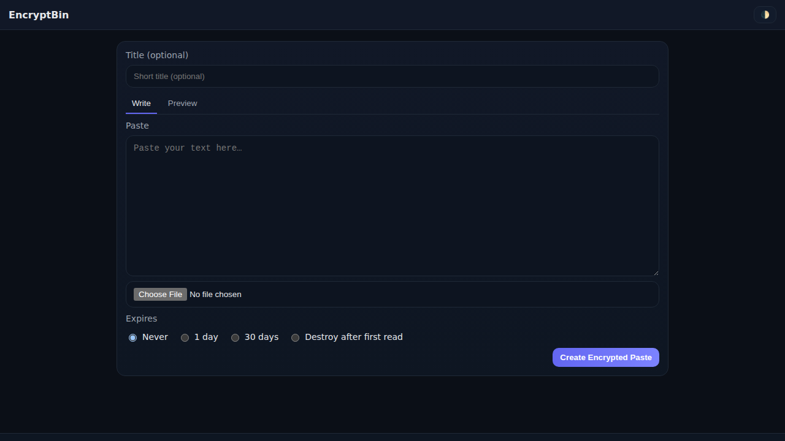
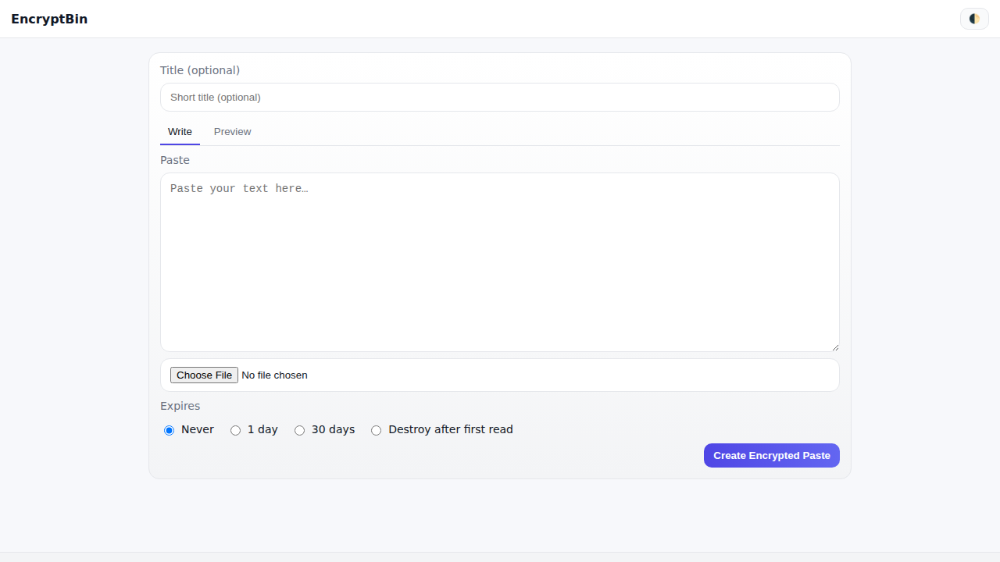
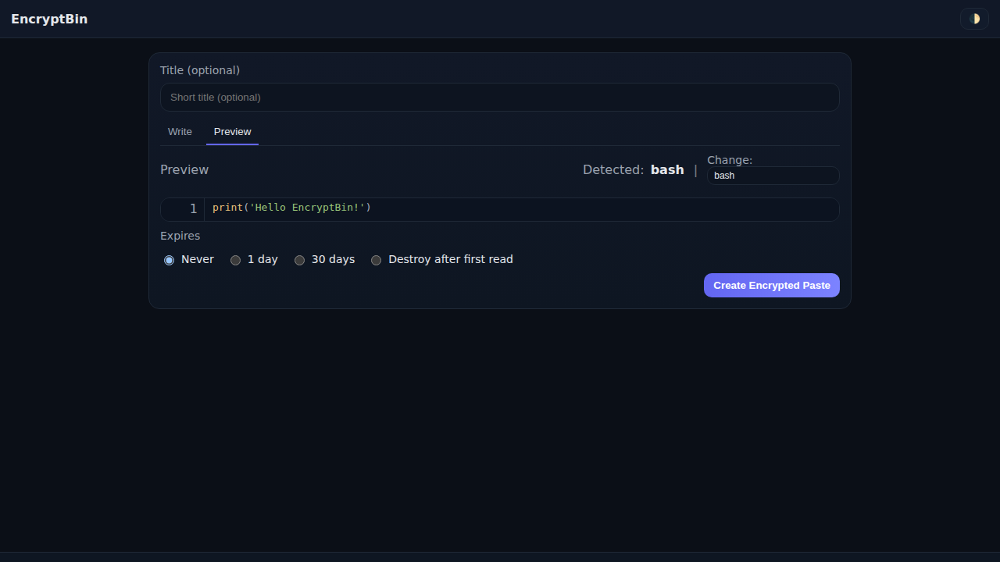
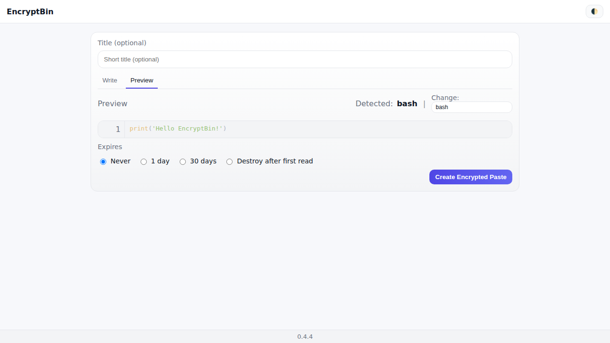
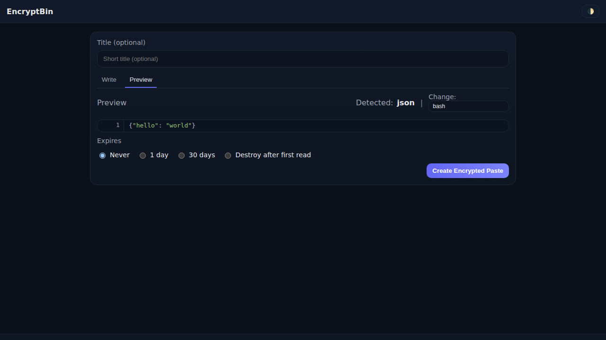
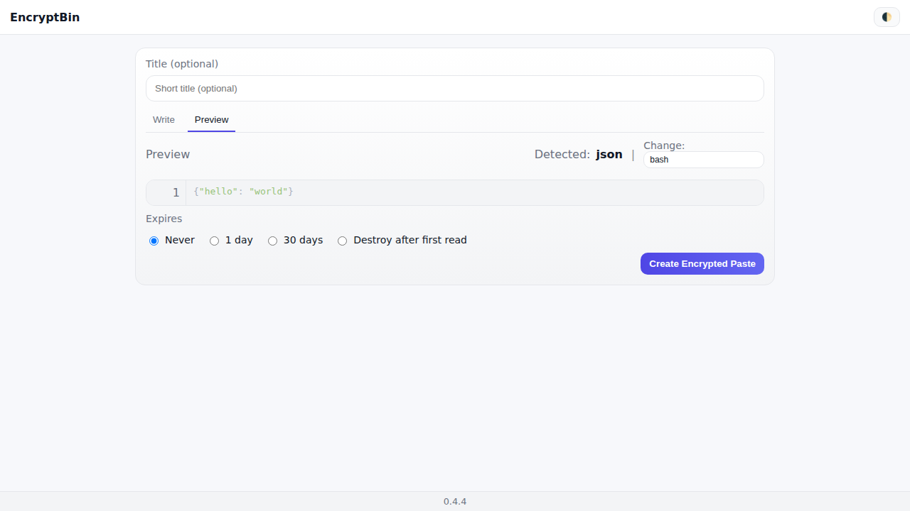
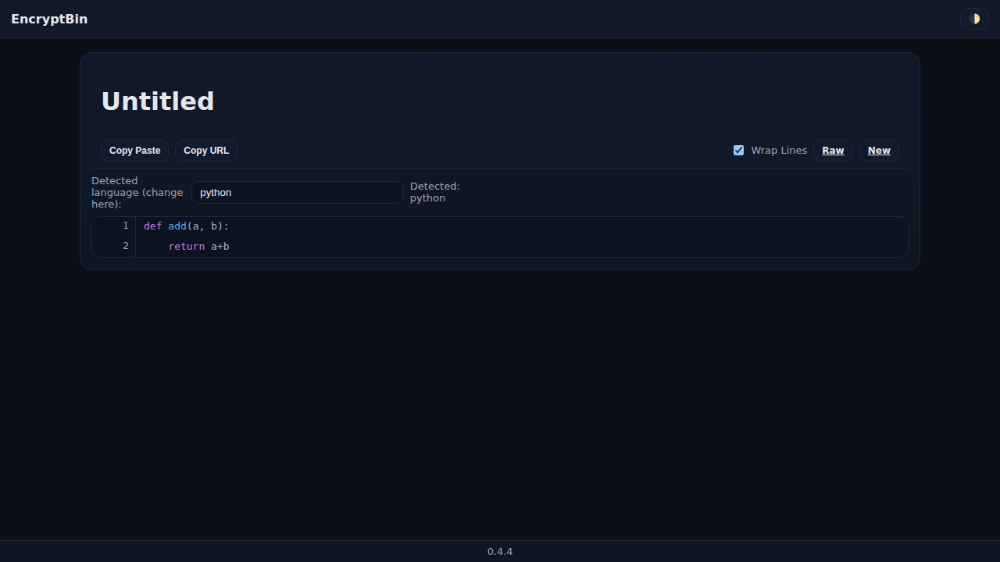
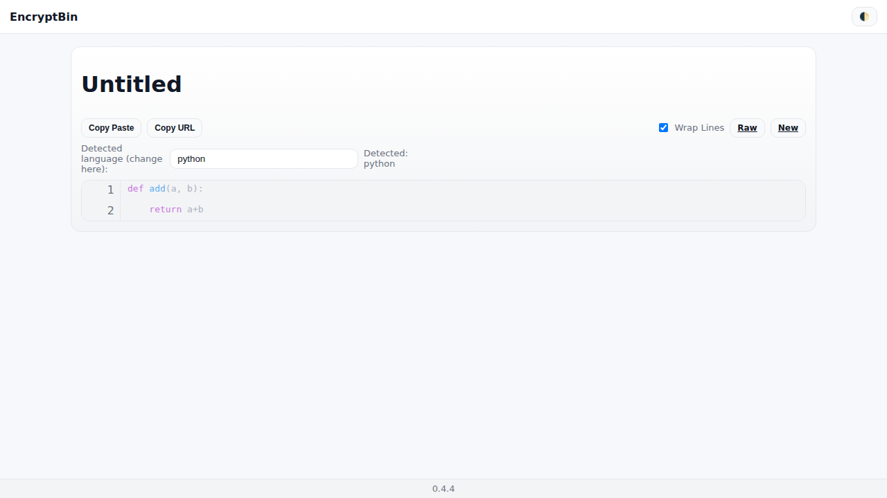

# 🔐 EncryptBin

[](https://github.com/pmalinen/EncryptBin/actions/workflows/CI.yml)
[](https://codecov.io/gh/pmalinen/EncryptBin)
[](https://github.com/pmalinen/EncryptBin/actions/workflows/screenshots.yml)
[](https://hub.docker.com/r/pmalinen/encryptbin)
[](https://hub.docker.com/r/pmalinen/encryptbin/tags)

**EncryptBin** is a self-hosted, minimal, and secure pastebin alternative.
All pastes are **encrypted client-side** with AES-256 before they are sent to the server when using the web UI.
The server never sees your plaintext. A plaintext API endpoint exists for automation, but is **disabled by default**.

---

## 🚀 Quick Start

### Run with Docker

```bash
docker run -d \
  --name encryptbin \
  -p 8000:8000 \
  -v $(pwd)/data:/app/data \
  -e STORAGE_BACKEND=local \
  pmalinen/encryptbin:latest
```

- Service runs at <http://localhost:8000>
- Data is persisted locally in `./data`
- Use environment variables to configure (see below)

### Run with Docker Compose

```yaml
version: "3.9"
services:
  encryptbin:
    image: pmalinen/encryptbin:latest
    container_name: encryptbin
    ports:
      - "8000:8000"
    volumes:
      - ./data:/app/data
    environment:
      - STORAGE_BACKEND=local
      # - STORAGE_BACKEND=s3
      # - S3_BUCKET=your-bucket
```

Then:

```bash
docker compose up -d
```

---

## ⚙️ Configuration

Set environment variables in `.env` or your deployment environment:

| Variable                      | Default | Description                                                                 |
|-------------------------------|---------|-----------------------------------------------------------------------------|
| `STORAGE_BACKEND`             | `local` | Storage type: `local` or `s3`.                                              |
| `DATA_DIR`                    | `data`  | Local storage directory.                                                    |
| `S3_BUCKET`                   | —       | Name of S3 bucket if using S3.                                              |
| `S3_REGION`                   | —       | Region of the bucket.                                                       |
| `S3_ENDPOINT`                 | —       | Optional custom S3 endpoint.                                                |
| `API_TOKENS`                  | —       | Comma-separated API tokens (optional for automation).                       |
| `ENCRYPTBIN_ALLOW_PLAINTEXT`  | `false` | Enable raw plaintext storage/ingest API (automation via curl).              |

> 🔒 **Security note:** Keep `ENCRYPTBIN_ALLOW_PLAINTEXT=false` unless you explicitly need the automation endpoint.
> When enabled, use `Authorization: Bearer <token>` with tokens from `API_TOKENS`.

---

## 🧰 CLI / curl usage (automation)

> These examples require `ENCRYPTBIN_ALLOW_PLAINTEXT=true` on the server (disabled by default).
> If `API_TOKENS` is set, include `-H "Authorization: Bearer $ENCRYPTBIN_TOKEN"`.

### Create a paste from a file

```bash
curl -fsS -X POST \
  -H "Authorization: Bearer $ENCRYPTBIN_TOKEN" \
  -F "content=@build.log" \
  -F "title=Nightly build log" \
  -F "expire=30d" \
  -F "burn_after=0" \
  https://your-encryptbin.example.com/paste
```

### Create a paste from stdin

```bash
echo "hello from CI $(date)" | \
curl -fsS -X POST \
  -H "Authorization: Bearer $ENCRYPTBIN_TOKEN" \
  -F "content=@-" \
  -F "title=CI output" \
  -F "expire=1d" \
  https://your-encryptbin.example.com/paste
```

### Fields

- `content` — required. File path or `@-` for stdin.
- `title` — optional string (max ~140 chars).
- `expire` — one of `never`, `1d`, `30d` (default: `never`).
- `burn_after` — `1` or `0` (default: `0`).

### Read raw / share

- Raw view: `https://your-encryptbin.example.com/raw/<id>`
- Pretty view: `https://your-encryptbin.example.com/<id>#<key>` (browser decrypts if created via UI)

> ℹ️ Encrypted pastes created in the browser include a decryption key in the URL fragment (`#...`),
> which is **never sent** to the server.

---

## 📸 Screenshots

Latest screenshots are automatically generated in CI and committed to
[`docs/screenshots`](docs/screenshots). They also render inline here:

### Write
Dark: 
Light: 

### Preview (Python)
Dark: 
Light: 

### Preview (JSON)
Dark: 
Light: 

### View (Python)
Dark: 
Light: 

---

## 📂 Examples

### 1) GitHub Actions → send build logs to EncryptBin

`.github/workflows/example-post-logs.yml`:

```yaml
name: Post build logs
on: [push]

jobs:
  logs:
    runs-on: ubuntu-latest
    steps:
      - uses: actions/checkout@v3

      - name: Create log
        run: |
          echo "Build started at $(date)" > build.log
          echo "Commit: $GITHUB_SHA" >> build.log

      - name: Post logs to EncryptBin
        env:
          ENCRYPTBIN_TOKEN: ${{ secrets.ENCRYPTBIN_TOKEN }}
        run: |
          curl -fsS -X POST \
            -H "Authorization: Bearer $ENCRYPTBIN_TOKEN" \
            -F "content=@build.log" \
            -F "title=CI build log" \
            -F "expire=30d" \
            https://your-encryptbin.example.com/paste
```

> Requires server with `ENCRYPTBIN_ALLOW_PLAINTEXT=true` and a token in `API_TOKENS`.

### 2) Ansible → upload a log as a paste

Snippet:

```yaml
- name: Upload logs to EncryptBin
  uri:
    url: "https://your-encryptbin.example.com/paste"
    method: POST
    headers:
      Authorization: "Bearer {{ encryptbin_token }}"
    body_format: form-multipart
    body:
      title: "syslog from {{ inventory_hostname }}"
      expire: "1d"
      burn_after: "0"
      content: "{{ lookup('file', '/var/log/syslog') }}"
  register: paste_response

- debug:
    var: paste_response.json
```

### 3) systemd unit running the Docker image

```ini
[Unit]
Description=EncryptBin
After=network.target

[Service]
Restart=always
ExecStart=/usr/bin/docker run --rm \
  -p 8000:8000 \
  -v /opt/encryptbin/data:/app/data \
  -e STORAGE_BACKEND=local \
  --name encryptbin pmalinen/encryptbin:latest
ExecStop=/usr/bin/docker stop encryptbin

[Install]
WantedBy=multi-user.target
```

Enable & start:

```bash
sudo systemctl enable encryptbin
sudo systemctl start encryptbin
```

---

## 🧪 Development

Run locally with Docker:

```bash
docker compose up --build
```

Or run directly:

```bash
pip install -r requirements.txt
uvicorn app:app --reload --host 0.0.0.0 --port 8000
```

---

## 📝 License

[MIT License](LICENSE)

---

## 🏷 Version

0.4.4
