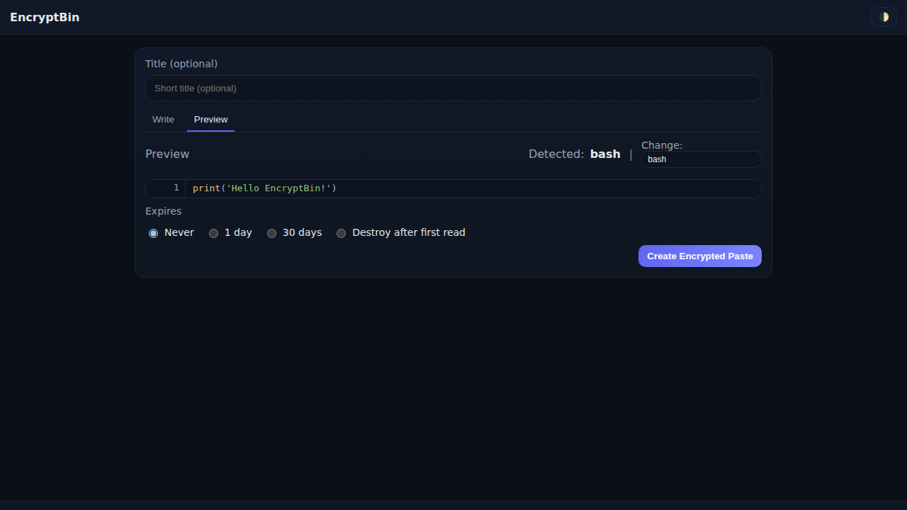
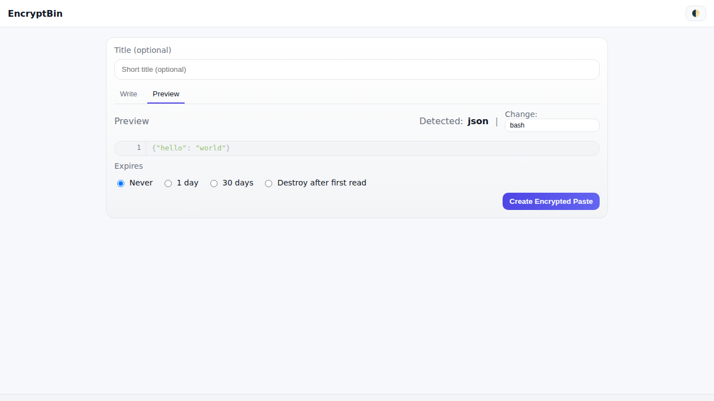
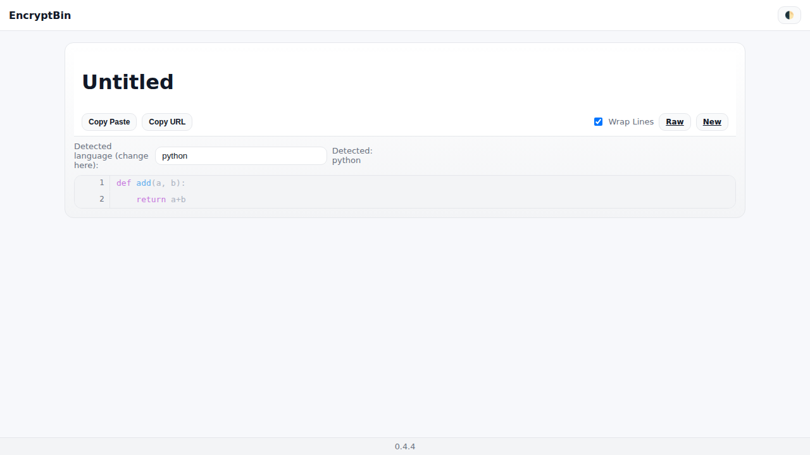

# 🔐 EncryptBin

[](https://github.com/pmalinen/EncryptBin/actions/workflows/CI.yml)
[](https://codecov.io/gh/pmalinen/EncryptBin)
[](https://github.com/pmalinen/EncryptBin/actions/workflows/screenshots.yml)

**EncryptBin** is a self-hosted, minimal, and secure pastebin alternative.
All pastes are **encrypted client-side** with AES-256 before they are sent to the server.
The server never sees your plaintext.

---

## ✨ Features

- 🔑 **Zero-knowledge encryption**: Browser generates a random AES-256 key; the key never leaves the client.
- ⏱ **Expiration**: Choose between *Never* (default), *1 day*, *30 days*, or *Burn after reading*.
- 📄 **Syntax highlighting**: Automatic detection, with option to manually override.
- 🖥 **Dark/Light mode**: Auto-detected from your OS, with a toggle.
- 📋 **Clipboard helpers**: One-click copy of paste content or URL.
- 📝 **Editable titles**: Author can edit the paste title inline (saved via edit key).
- 📂 **File upload**: If pastes are too large for copy/paste.
- 🧹 **Cleanup job**: Automatic removal of expired pastes (local or S3).
- 🔑 **API tokens (optional)**: For automated ingestion.

---

## 📸 Screenshots

### Write
Dark: 
Light: 

### Preview (Python)
Dark: 
Light: 

### Preview (JSON)
Dark: 
Light: 

### View (Python)
Dark: 
Light: 
---

## ⚙️ Configuration

Set environment variables in `.env` or your deployment environment:

| Variable            | Default | Description                          |
|---------------------|---------|--------------------------------------|
| `STORAGE_BACKEND`   | `local` | Storage type: `local` or `s3`.       |
| `DATA_DIR`          | `data`  | Local storage directory.             |
| `S3_BUCKET`         | —       | Name of S3 bucket if using S3.       |
| `S3_REGION`         | —       | Region of the bucket.                |
| `S3_ENDPOINT`       | —       | Optional custom S3 endpoint.         |
| `API_TOKENS`        | —       | Comma-separated API tokens (optional).|


## 🚀 Quick Start

### With Docker Compose
```bash
git clone https://github.com/pmalinen/EncryptBin.git
cd encryptbin
docker compose up --build
```

---

## 🔧 Examples

The [`examples/`](examples) folder contains ready-to-use integrations:

- **GitHub Actions**
  Example workflow to upload build/test logs as an encrypted paste.
  Useful when logs are too long for PR comments.
  → See [`examples/github-actions.yml`](examples/github-actions.yml)

- **Ansible Playbook**
  Example playbook that posts deployment info or secrets to EncryptBin.
  → See [`examples/ansible-playbook.yml`](examples/ansible-playbook.yml)

- **Curl**
  Simple curl command to upload a paste directly from the terminal.
  ```bash
  curl -X POST http://localhost:8000/api/paste \
       -H "Content-Type: application/json" \
       -d '{"content":"Hello from curl!"}'

## 📝 License
[MIT License](LICENSE)

## 🏷 Version
0.4.4
