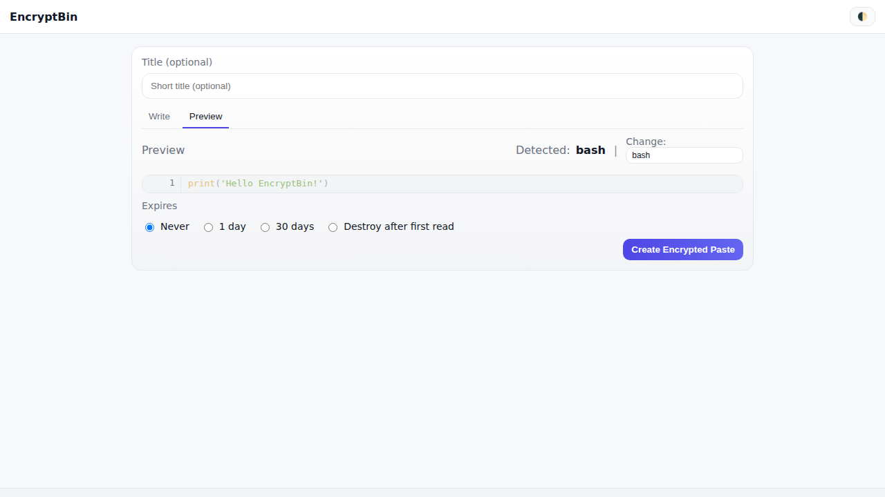

# 🔐 EncryptBin

[](https://github.com/pmalinen/EncryptBin/actions/workflows/ci.yml)
[](https://codecov.io/gh/pmalinen/EncryptBin)
[](https://github.com/pmalinen/EncryptBin/actions/workflows/screenshots.yml)
[](https://hub.docker.com/r/pmalinen/encryptbin)
[](https://hub.docker.com/r/pmalinen/encryptbin/tags)

**EncryptBin** is a self-hosted, minimal, and secure pastebin alternative.
All pastes are **encrypted client-side** with AES-256 before they are sent to the server when using the web UI.
The server never sees your plaintext. A plaintext API endpoint exists for automation, but is **disabled by default**.

---
## ✨ Features
- 🔒 Client-side AES-256-GCM encryption
- 🔑 Zero-knowledge: encryption key is only in the URL fragment (`#key`)
- 🌓 Light/dark theme (auto-detected from system, toggle available)
- 📋 One-click copy of paste content or URL
- ⏱ Expiration: 1 day, 30 days, never, or burn-after-read
- 🔍 Automatic syntax highlighting (with manual override)
- 🗑 Background cleanup of expired pastes (local or S3)
- 📦 Docker-ready, with Caddy reverse proxy for HTTPS
- 🧪 CI-ready with GitHub Actions and Ansible integration examples

---

## 🚀 Quick Start

### Run with Docker

```bash
docker run -d \
  --name encryptbin \
  -p 8000:8000 \
  -v $(pwd)/data:/app/data \
  -e STORAGE_BACKEND=local \
  pmalinen/encryptbin:latest
```

- Open: [https://localhost](https://localhost) (Caddy provides local TLS).
- Data is persisted locally in `./data`
- Use environment variables to configure (see below)

### Run with Docker Compose

```yaml
version: "3.9"
services:
  encryptbin:
    image: pmalinen/encryptbin:latest
    container_name: encryptbin
    ports:
      - "8000:8000"
    volumes:
      - ./data:/app/data
    environment:
      - STORAGE_BACKEND=local
      # - STORAGE_BACKEND=s3
      # - S3_BUCKET=your-bucket
```

Then:

```bash
docker compose up -d
```

---

## ⚙️ Configuration

Set environment variables in `.env` or your deployment environment:

| Variable                      | Default | Description                                                                 |
|-------------------------------|---------|-----------------------------------------------------------------------------|
| `STORAGE_BACKEND`             | `local` | Storage type: `local` or `s3`.                                              |
| `DATA_DIR`                    | `data`  | Local storage directory.                                                    |
| `S3_BUCKET`                   | —       | Name of S3 bucket if using S3.                                              |
| `S3_REGION`                   | —       | Region of the bucket.                                                       |
| `S3_ENDPOINT`                 | —       | Optional custom S3 endpoint.                                                |
| `API_TOKENS`                  | —       | Comma-separated API tokens (optional for automation).                       |
| `ENCRYPTBIN_STORAGE` | `local` | Storage backend: `local` or `s3` |
| `ENCRYPTBIN_DATA_DIR` | `/data` | Directory for local storage |
| `ENCRYPTBIN_S3_BUCKET` | *(unset)* | S3 bucket name |
| `ENCRYPTBIN_ALLOW_PLAINTEXT` | `false` | Allow unencrypted plaintext pastes |
| `APP_VERSION` | from build | Shown in footer |

- `ENCRYPTBIN_ALLOW_PLAINTEXT=true` → enables `/api/paste` (server-side plaintext pastes).
- Otherwise use `/api/paste_encrypted` (recommended).
---

## 🧰 CLI / curl usage (automation)

> These examples require `ENCRYPTBIN_ALLOW_PLAINTEXT=true` on the server (disabled by default).
> If `API_TOKENS` is set, include `-H "Authorization: Bearer $ENCRYPTBIN_TOKEN"`.

### Create a paste from a file

```bash
curl -fsS -X POST \
  -H "Authorization: Bearer $ENCRYPTBIN_TOKEN" \
  -F "content=@build.log" \
  -F "title=Nightly build log" \
  -F "expire=30d" \
  -F "burn_after=0" \
  https://your-encryptbin.example.com/paste
```

### Create a paste from stdin

```bash
echo "hello from CI $(date)" | \
curl -fsS -X POST \
  -H "Authorization: Bearer $ENCRYPTBIN_TOKEN" \
  -F "content=@-" \
  -F "title=CI output" \
  -F "expire=1d" \
  https://your-encryptbin.example.com/paste
```

### Fields

- `content` — required. File path or `@-` for stdin.
- `title` — optional string (max ~140 chars).
- `expire` — one of `never`, `1d`, `30d` (default: `never`).
- `burn_after` — `1` or `0` (default: `0`).

### Read raw / share

- Raw view: `https://your-encryptbin.example.com/raw/<id>`
- Pretty view: `https://your-encryptbin.example.com/<id>#<key>` (browser decrypts if created via UI)

> ℹ️ Encrypted pastes created in the browser include a decryption key in the URL fragment (`#...`),
> which is **never sent** to the server.

---

## 📸 Screenshots

Latest screenshots are automatically generated in CI and committed to
[`docs/screenshots`](docs/screenshots). They also render inline here:

### Write
Dark: 
Light: 

### Preview (Python)
Dark: 
Light: 

### Preview (JSON)
Dark: 
Light: 

### View (Python)
Dark: 
Light: 

---

## 📡 API Examples

### 🔑 Encrypted paste (preferred)

Use the provided wrapper script in [`examples/encryptbin-upload.sh`](examples/encryptbin-upload.sh):

```bash
./examples/encryptbin-upload.sh file.txt "Nightly build log" 30d
```

Response:

```
Shareable link: https://localhost/p/abc123def456#<key>
```

The server never sees `<key>`.

### 📝 Plaintext paste (only if enabled)

```bash
curl -k -X POST   -F "content=@extracted_data.csv"   -F "title=Nightly build log"   -F "expire=30d"   -F "burn_after=0"   https://localhost/api/paste
```

Response:

```
{
  "id": "77a8fa7d79fb",
  "url": "https://localhost/p/77a8fa7d79fb",
  "raw_url": "https://localhost/raw/77a8fa7d79fb",
  "edit_key": "..."
}
```

---

## ⚙️ Examples

See the [`examples/`](examples/) folder:

- `encryptbin-upload.sh` → secure encrypted upload with curl
- `github-action.yml` → post CI logs to EncryptBin
- `ansible-role.yml` → push deployment logs to EncryptBin
- `systemd-service.yml` → run EncryptBin as a service

---
## 🧹 Cleanup

Expired pastes are removed automatically by the `encryptbin-cleanup` sidecar container (works for local and S3 storage).

---

## 🛡 Security Model

- The browser generates a random AES key.
- Content is encrypted client-side with AES-GCM.
- Only ciphertext is sent to the server.
- The server only stores encrypted blobs + metadata.
- The shareable URL includes the key in the hash (`#key`), which never leaves the browser.

This means:
✅ No keys in logs, database, or API calls.
✅ Even administrators cannot read your pastes.
✅ All decryption and highlighting happens client-side.

---

## 🧪 Development

Lint + format:

```bash
pre-commit run --all-files
```

Run tests:

```bash
pytest
```

Run locally with Docker:

```bash
docker compose up --build
```

Or run directly:

```bash
pip install -r requirements.txt
uvicorn app:app --reload --host 0.0.0.0 --port 8000
```

---

## 📝 License & Community

- Licensed under the [MIT License](LICENSE)
- See [CONTRIBUTING.md](CONTRIBUTING.md) for contribution guidelines
- Read our [Code of Conduct](CODE_OF_CONDUCT.md) to foster an open and welcoming environment
- See [SECURITY.md](SECURITY.md) for reporting vulnerabilities

---
